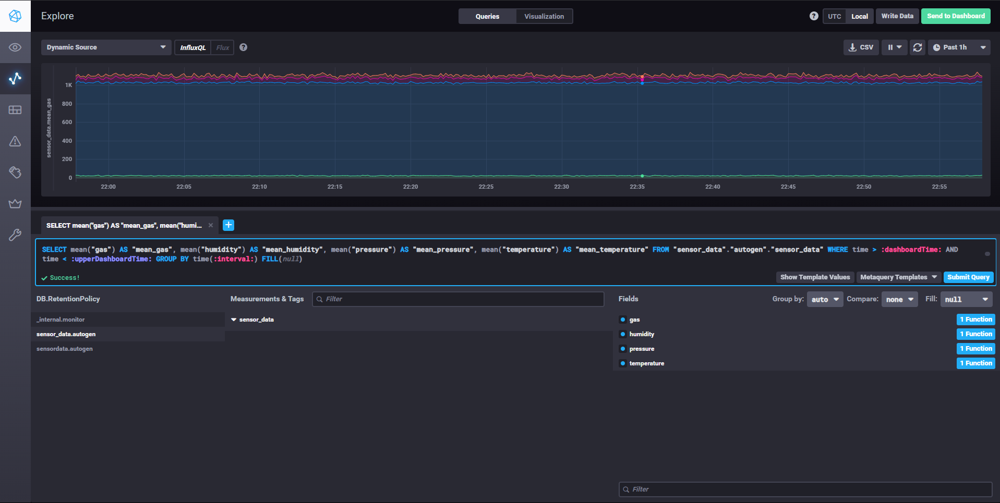
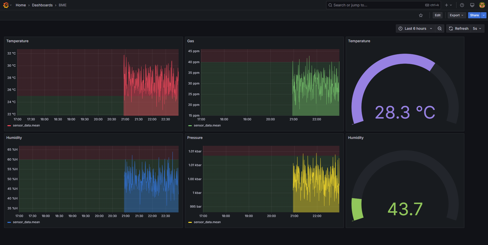

# IoT Monitoring Stack

A comprehensive IoT monitoring solution using Docker containers for MQTT communication, data processing, storage, and visualization.

## Architecture Overview

This project provides a ready-to-use stack of containerized services for IoT data collection and visualization:


## Components

### 1. Mosquitto MQTT Broker
- **Purpose**: Lightweight message broker for IoT device communication
- **Why**: MQTT is the industry standard for IoT device communication due to its low bandwidth requirements and reliability
- **Port**: 1883 (MQTT), 9001 (WebSocket)


### 2. Node-RED
- **Purpose**: Flow-based programming tool for connecting IoT devices and services
- **Why**: Provides a visual editor for wiring together hardware devices, APIs, and online services
- **Port**: 1880
- **Configuration**: Configured to subscribe to MQTT topics and store data in InfluxDB


### 3. InfluxDB
- **Purpose**: Time-series database optimized for high write and query loads
- **Why**: Purpose-built for handling time-series data from IoT sensors with high ingestion rates
- **Port**: 8086
- **Database**: sensor_data



### 4. Grafana
- **Purpose**: Visualization and analytics platform
- **Why**: Provides rich interactive dashboards for IoT monitoring with alerting capabilities
- **Port**: 3000
- **Features**: Dashboard for visualizing sensor data, alerts, annotations



### 5. Portainer
- **Purpose**: Container management
- **Why**: Simplifies Docker management with a user-friendly web interface
- **Port**: 9000
- **Features**: Container monitoring, logs, and management


## Getting Started

### Prerequisites
- Docker and Docker Compose installed
- Basic understanding of IoT communication protocols
- ESP8266 or similar IoT device (optional)

### Deployment

1. Clone this repository:
```powershell
git clone https://github.com/charan/IoT-DataStream.git
cd IoT-DataStream
```

2. Start the stack:
```powershell
docker-compose up -d
```


3. Access the services:
   - Grafana: http://localhost:3000 (default credentials: admin/admin)
   - Node-RED: http://localhost:1880
   - Portainer: http://localhost:9000
   - InfluxDB: http://localhost:8086

## ESP8266 Sample Code

This project includes sample Arduino code (`mqtt_code.ino`) for ESP8266 devices that:
- Connects to WiFi
- Connects to the MQTT broker
- Generates simulated sensor data (temperature, pressure, humidity, gas)
- Publishes data to the `/home/sensors` topic every 5 seconds

Example output from the Arduino serial monitor:


```cpp
const char* ssid = "YOUR_WIFI_SSID";  // WiFi name
const char* password = "YOUR_WIFI_PASSWORD";  // WiFi password
const char* mqtt_server = "192.168.1.3";  // MQTT broker address (your computer's IP)
```

## Data Flow

1. **ESP8266 Device**: Collects sensor data and publishes to MQTT topic `/home/sensors`
2. **Mosquitto MQTT Broker**: Receives messages and forwards to subscribers
3. **Node-RED**: 
   - Subscribes to `/home/sensors` topic
   - Processes JSON messages
   - Formats data for InfluxDB storage
4. **InfluxDB**: Stores time-series sensor data
5. **Grafana**: Queries InfluxDB and visualizes data in dashboards

## Challenges and Solutions

### 1. Container Networking
**Challenge**: Ensuring proper communication between containers and with external IoT devices
**Solution**: Used Docker network inspection to identify container IP addresses and configured services accordingly

### 2. MQTT Connectivity
**Challenge**: ESP8266 couldn't connect to MQTT broker
**Solution**: 
- Updated broker address to use host machine's actual IP address
- Added firewall rules to allow MQTT port 1883
- Enhanced reconnection logic in ESP8266 code

### 3. InfluxDB Configuration
**Challenge**: Grafana showing "connection refused" errors when trying to connect to InfluxDB
**Solution**: Verified and corrected IP address in Grafana data source configuration (changed from 172.18.0.4 to 172.18.0.2)

### 4. Data Persistence
**Challenge**: Container restarts would lose data
**Solution**: Implemented volume mounts for all services to persist data on the host machine

## Customization

### Mosquitto Configuration
The Mosquitto broker is configured in `mosquitto/config/mosquitto.conf`:

```
persistence true
persistence_location /mosquitto/data/
log_dest file /mosquitto/log/mosquitto.log
listener 1883
allow_anonymous true
```

### Node-RED Flows
Node-RED flows are defined in `nodered/flows.json` and can be edited using the Node-RED web interface.

### Grafana Dashboards
Create custom dashboards in Grafana to visualize your IoT sensor data with different panels and visualization options.

## Troubleshooting

### MQTT Connection Issues
- Verify the MQTT broker IP address is correct in your IoT device code
- Check if port 1883 is open in your firewall
- Use MQTT Explorer to test the broker connection

### InfluxDB Connection Errors
- Verify the correct InfluxDB IP address in Node-RED and Grafana
- Check that the database "sensor_data" exists
- Check InfluxDB logs for any errors

### Grafana Visualization Issues
- Verify the data source configuration
- Check query formatting
- Ensure time ranges are properly set

## Maintenance

### Backing Up Data
```powershell
# Stop the stack
docker-compose down

# Back up volume directories
Copy-Item -Path "./influxdb" -Destination "./backups/influxdb_$(Get-Date -Format 'yyyyMMdd')" -Recurse
Copy-Item -Path "./grafana" -Destination "./backups/grafana_$(Get-Date -Format 'yyyyMMdd')" -Recurse
Copy-Item -Path "./nodered" -Destination "./backups/nodered_$(Get-Date -Format 'yyyyMMdd')" -Recurse

# Restart the stack
docker-compose up -d
```

### Updating Containers
```powershell
docker-compose pull
docker-compose up -d
```

## License

MIT License

Copyright (c) 2025 Charan

Permission is hereby granted, free of charge, to any person obtaining a copy
of this software and associated documentation files (the "Software"), to deal
in the Software without restriction, including without limitation the rights
to use, copy, modify, merge, publish, distribute, sublicense, and/or sell
copies of the Software, and to permit persons to whom the Software is
furnished to do so, subject to the following conditions:

The above copyright notice and this permission notice shall be included in all
copies or substantial portions of the Software.

THE SOFTWARE IS PROVIDED "AS IS", WITHOUT WARRANTY OF ANY KIND, EXPRESS OR
IMPLIED, INCLUDING BUT NOT LIMITED TO THE WARRANTIES OF MERCHANTABILITY,
FITNESS FOR A PARTICULAR PURPOSE AND NONINFRINGEMENT. IN NO EVENT SHALL THE
AUTHORS OR COPYRIGHT HOLDERS BE LIABLE FOR ANY CLAIM, DAMAGES OR OTHER
LIABILITY, WHETHER IN AN ACTION OF CONTRACT, TORT OR OTHERWISE, ARISING FROM,
OUT OF OR IN CONNECTION WITH THE SOFTWARE OR THE USE OR OTHER DEALINGS IN THE
SOFTWARE.

## Acknowledgments
- The Docker community
- The MQTT, Node-RED, InfluxDB, and Grafana communities
- ESP8266 and Arduino communities
